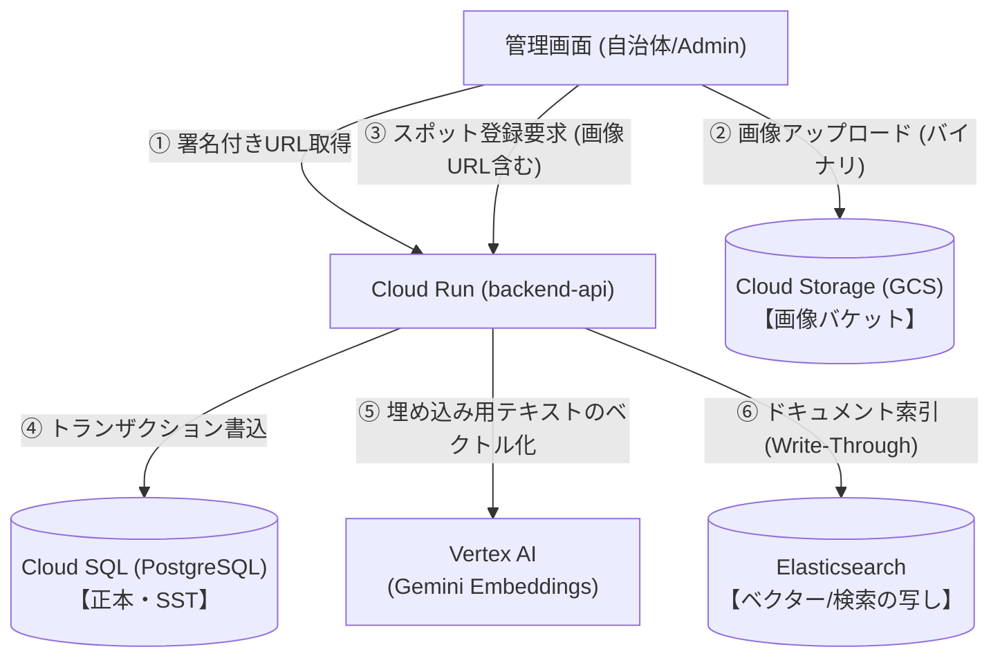
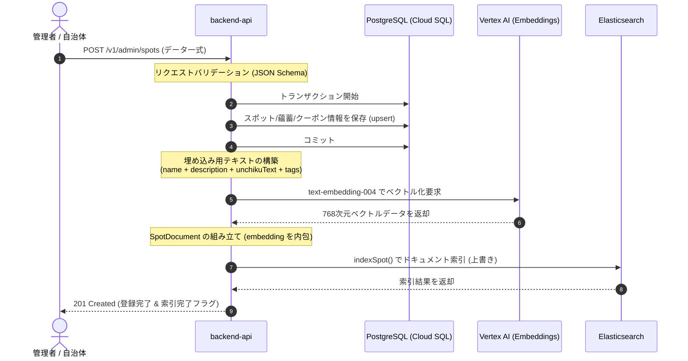
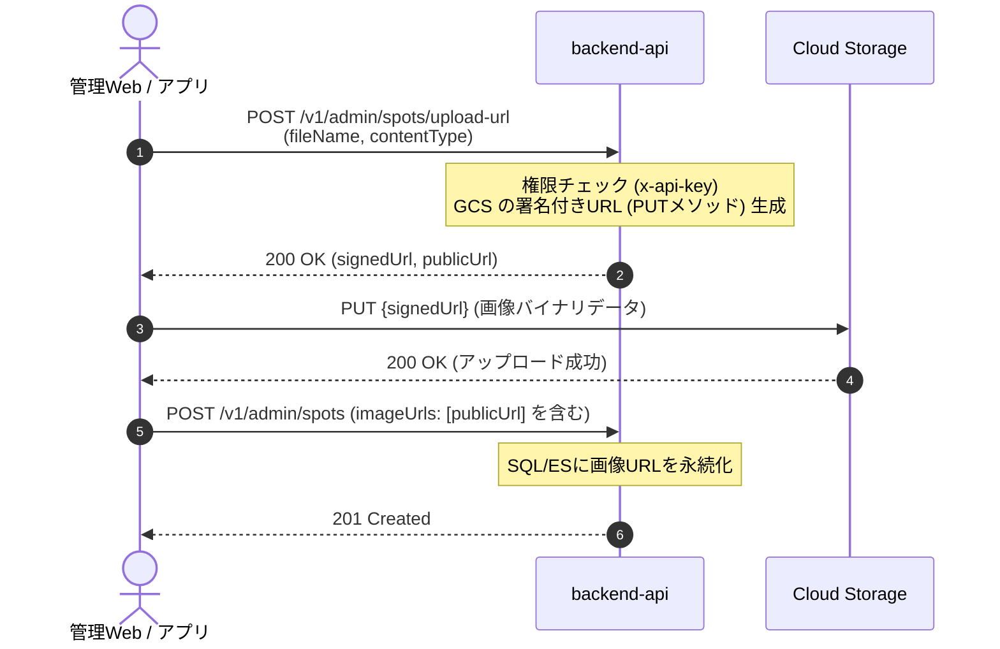

# データプラットフォーム設計詳細

本ドキュメントは、「旅サキ」バックエンドにおけるデータプラットフォーム（データ取り込み、データ同期、画像管理、および秘匿情報管理）のアーキテクチャおよび詳細設計を定義する。

---

## 1. 全体アーキテクチャ概要

データの「正本（信頼できる唯一の情報源：Single Source of Truth）」を PostgreSQL（Cloud SQL）に置き、検索や地理・ベクタークエリなどの「参照の写し」として Elasticsearch（Elastic Cloud）を配置する CQRS（コマンドクエリ責務分離）パターンの構成をとる。

---

## 2. データ取り込み (Ingestion) & 同期フロー

### 2.1 スポット注入シーケンス (Write-Through)

管理者API経由でスポットデータ（スポット基本情報、蘊蓄、クーポン）が登録・更新された際、同期的にデータベースと検索エンジンへ二重書き込みを行う。

#### 整合性エラー発生時の考慮 (フォールバック)
* **同期処理のタイムアウト・一時エラー**: 
  ステップ 7 (ES 索引) で一時的な接続エラーが生じた場合、管理者には成功（200 / 201）を返しつつ、バックエンドログに重大警告を出力し、後述する**再同期バッチ (Reindex/Embed-Spots)** で最終整合性を確保する。
* **非同期キューへの拡張展望 (Should)**: 
  書き込み完了時の低レイテンシ化のため、ステップ 5〜7（Gemini 呼び出し、ES 索引）を Cloud Tasks 等の非同期キューにオフロードし、バックグラウンドでの自動リトライ付き非同期取り込み (CDC または Outbox パターン) へ拡張可能とする。

### 2.2 再同期・データ修復バッチ

PostgreSQL と Elasticsearch の間で不整合（データの未同期、またはベクトル未生成）が生じた場合、バッチ処理でデータの一方向同期および埋め込み再生成を行う。

1. **`reindex` バッチ (Postgres → ES 同方向同期)**
   * **処理**: `iterateAllSpots` で PostgreSQL からデータをバッチ単位（既定500件）で読み込み、Elasticsearch の `spots` インデックスに `bulk` API を用いて一括上書き登録する。この段階ではベクトル化はスキップし、高速に基本データの同期を完了させる。
   * **コマンド**: `pnpm -C services/backend-api reindex`
2. **`embed-spots` バッチ (バルクベクトル化)**
   * **処理**: DB からスポットデータを読み込み、埋め込みテキスト（`buildSpotEmbedText`）を構築して Gemini でベクトル化し、Elasticsearch 側の `embedding` フィールドへ一括索引する。
   * **レート制限対策**: 
     API のレート制限 (TPM/RPM) を考慮し、バッチサイズ（既定50件）を制限するとともに、Gemini API 呼び出しの間に一定の間隔を設ける仕様。
   * **コマンド**: `pnpm -C services/backend-api embed-spots`

---

## 3. 画像管理 (GCS 連携) 設計

スポット画像は、API サーバーを仲介させず、フロントエンド（管理Webなど）から **Cloud Storage (GCS)** へ直接セキュアにアップロードする **「署名付きURL (Signed URL) 方式」** を採用する。

### 3.1 アップロードシーケンス

### 3.2 署名付きURLの発行仕様
* **HTTP メソッド**: `PUT`
* **Content-Type**: クライアントから申告された値（`image/jpeg`, `image/png` 等）を署名にバインドし、アップロード時の偽装を防止する。
* **有効期間**: 5分（短期間のワンタイムURLとして利用）。
* **バケット構成**: 
  - `tabisaki-spot-images` (一般公開・読み取り専用バケット)
  - アップロードされたパス: `spots/{spotId}/{randomUUID}.jpg`

---

## 4. Secret Manager 連携設計

本番環境（Cloud Run）において、ソースコード内にAPIキーなどの資格情報を直接記述（ハードコーディング）することを禁止し、Google Cloud Secret Manager を経由して動的に解決する。

### 4.1 解決方式 (Secret Mount & Env Injection)
Cloud Run の服务構成において、以下の Secret をコンテナの環境変数にマッピングして注入する。

| 環境変数名 | Secret Manager 内のリソース名 | 用途 |
|:---|:---|:---|
| `DATABASE_URL` | `tabisaki-postgres-url` | PostgreSQL 接続情報 (SSL必須) |
| `ES_NODE` | `tabisaki-elasticsearch-node` | Elastic Cloud の接続エンドポイント |
| `ES_API_KEY` | `tabisaki-elasticsearch-api-key` | Elasticsearch 接続用の API キー |
| `GEMINI_API_KEY` | `tabisaki-gemini-api-key` | Vertex AI / Gemini API へのアクセスキー |
| `GOOGLE_MAPS_API_KEY` | `tabisaki-maps-api-key` | Google Maps Routes API キー |

### 4.2 ローカル開発時のエミュレーション
ローカル環境では、各サービス直下の `.env` ファイルにローカル開発用（または開発環境用）の値を記述し、`dotenv` ライブラリ（または Node.js 20+ 標準の `--env-file`）経由で読み込むことで、本番と同様の環境変数インターフェースをシミュレートする。
* **ローカルでの秘匿情報管理**: `.env` ファイルは絶対に Git にコミットせず、`.gitignore` で除外する。代わりに構成テンプレートとして `.env.example` をリポジトリに含める。
