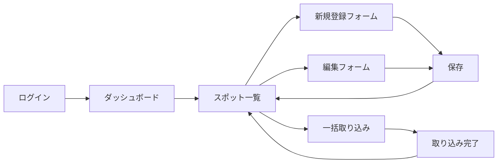

# 自治体向け管理画面 — Figma AI 設計指示書

> **プロダクト名:** tabipla（旅プラ）  
> **対象アプリ:** `apps/admin-web`（未実装・これから作る自治体職員向け Web 管理画面）  
> **デモ自治体:** 長野県小諸市  
> **想定利用者:** 観光課・地域振興課など、自治体の観光コンテンツ担当者（IT リテラシーは中程度。Excel と Web フォームは日常的に使う）

---

## 0. この文書の目的

Figma AI（Make designs / First draft 等）に、**自治体職員が観光スポット情報を登録・更新・公開する管理画面**の UI 設計を一括で依頼するための指示書です。

コード実装は別タスクです。本指示書のゴールは、**開発チームがそのまま実装に移れる粒度の Figma 画面・コンポーネント一式**を得ることです。

---

## 1. プロダクト背景（AI が理解すべき文脈）

tabipla は、旅行者向けに AI がスポットを推薦・蘊蓄（ローカルな豆知識）を生成する観光プラットフォームです。

```
自治体職員 ──(管理画面)──▶ backend-api ──▶ PostgreSQL（正本）
                              │
                              └──▶ Elasticsearch（検索用の写し）
                                        ▲
旅行者 ──(user-web / AIエージェント)────┘
```

**管理画面の役割**

- 観光スポット（Spot）の **CRUD**（作成・一覧・編集・削除）
- 一括取り込み（CSV / JSON）
- 蘊蓄の根拠データ（facts）の管理 ※将来
- クーポン情報の管理 ※将来
- 画像アップロード ※将来
- 検索インデックスの同期状態の確認

管理画面は Elasticsearch に直接触れません。保存後、バックエンドが自動で検索インデックスへ反映します。

---

## 2. デザインの方向性

### 2.1 トーン & マナー

| 項目 | 指示 |
|------|------|
| 印象 | **信頼感・公的サービスらしさ** と **モダンさ** の両立。堅すぎる行政 UI ではなく、Notion / Linear 系の整理された業務ツールに近い |
| 対比 | 旅行者向け `user-web` は slate ベースの軽快な検索 UI。管理画面は **やや落ち着いた業務色**（ネイビー / スレート / 白）で差別化 |
| 言語 | **UI 文言はすべて日本語**（ラベル・ボタン・空状態・エラー・トースト） |
| 密度 | 情報密度は **中〜高**。一覧はテーブル中心。フォームは 2 カラムレイアウト可 |
| アクセシビリティ | コントラスト WCAG AA 相当、フォーカスリング明示、エラーは色＋テキスト |

### 2.2 カラーパレット（初期案 — Variables 化すること）

| トークン名 | 用途 | 参考値 |
|-----------|------|--------|
| `color/primary` | 主要ボタン・リンク | `#0F172A`（slate-900） |
| `color/primary-hover` | ホバー | `#1E293B` |
| `color/accent` | 強調・選択中 | `#2563EB`（blue-600） |
| `color/success` | 保存成功・同期完了 | `#16A34A` |
| `color/warning` | 未同期・下書き | `#D97706` |
| `color/danger` | 削除・エラー | `#DC2626` |
| `color/surface` | ページ背景 | `#F8FAFC` |
| `color/card` | カード・パネル | `#FFFFFF` |
| `color/border` | 区切り線 | `#E2E8F0` |
| `color/text-primary` | 本文 | `#0F172A` |
| `color/text-secondary` | 補助文 | `#64748B` |

### 2.3 タイポグラフィ

- フォント: **Noto Sans JP**（見出し・本文共通）
- 見出し H1: 24px / Bold
- 見出し H2: 20px / Semibold
- 本文: 14px / Regular
- キャプション・メタ情報: 12px / Regular
- 数値・ID: tabular nums

### 2.4 レイアウト基準

| 項目 | 値 |
|------|-----|
| 主要ブレークポイント | Desktop **1440 × 900**（メイン）、Tablet 1024、Mobile 390（閲覧のみ・編集は Desktop 優先） |
| サイドバー幅 | 240px（折りたたみ時 64px） |
| コンテンツ最大幅 | 1200px（フォーム・詳細）、一覧はフル幅 |
| 角丸 | ボタン 8px、カード 12px、入力 6px |
| スペーシング | 8px グリッド（8 / 16 / 24 / 32 / 48） |

---

## 3. 情報設計（IA）とナビゲーション

### 3.1 グローバルナビ（サイドバー）

```
tabipla 管理
├── ダッシュボード
├── スポット管理          ← MVP 最優先
│   ├── 一覧
│   ├── 新規登録
│   └── 一括取り込み
├── 蘊蓄ファクト          ← Phase 2（画面だけ用意可）
├── クーポン              ← Phase 2
├── 設定                  ← Phase 2
└── （フッター）ログアウト
```

サイドバー上部に **自治体名バッジ**（例: 「小諸市」）を常時表示。

### 3.2 ヘッダー（各ページ共通）

- 左: ページタイトル + パンくず（例: スポット管理 / 編集）
- 右: 同期ステータスチップ（「検索インデックス: 同期済み」）、ユーザー名、ヘルプリンク

---

## 4. 画面一覧と詳細仕様

以下 **Must = MVP で必須**、**Should = ワイヤーまたはモックまで** とする。

---

### 4.1 ログイン（Must）

**目的:** API キーまたはメール＋パスワードで管理画面へ入る（認証方式は未確定のため、**汎用ログインフォーム**で設計）。

**要素**

- ロゴ + 「tabipla 管理画面」
- サブコピー: 「自治体向け観光コンテンツ管理」
- 入力: メールアドレス、パスワード
- ボタン: 「ログイン」
- 補助: 「パスワードをお忘れですか？」（リンクのみ・機能は未実装）
- エラー状態: 「メールアドレスまたはパスワードが正しくありません」

**レイアウト:** 中央カード（幅 400px）、背景は薄いグラデーションまたは写真（小諸の風景を抽象化したプレースホルダ可）

---

### 4.2 ダッシュボード（Must）

**目的:** 登録状況の概要とクイックアクション。

**ウィジェット（カード 2×2 グリッド）**

| カード | 内容 |
|--------|------|
| 登録スポット数 | 大きな数字（例: 42）+ 「前月比 +3」 |
| 未同期件数 | 警告色。0 件時は成功色 |
| 最近更新 | 直近 5 件のスポット名 + 更新日時リスト |
| クイックアクション | 「新規スポット登録」「CSV 一括取り込み」ボタン |

**空状態（初回）:** 「まだスポットが登録されていません。サンプルデータを取り込むか、新規登録から始めてください。」

---

### 4.3 スポット一覧（Must — 最重要）

**目的:** 登録済みスポットの検索・絞り込み・一括操作の起点。

**上部ツールバー**

- 検索ボックス（プレースホルダ: 「スポット名・タグ・住所で検索」）
- フィルタ: カテゴリ（観光 / グルメ / 宿泊 / 自然 / 歴史）、都道府県、更新日
- 主ボタン: 「+ 新規登録」（primary）
- 副ボタン: 「一括取り込み」「エクスポート」

**テーブル列**

| 列 | 内容 |
|----|------|
| チェックボックス | 一括削除用 |
| スポット名 | リンク → 詳細 |
| カテゴリ | バッジ |
| エリア | テキスト |
| タグ | 最大 3 件 + 「+2」 |
| 更新日 | `2026/06/15 14:30` 形式 |
| 同期 | チップ（同期済み / 同期待ち / エラー） |
| 操作 | ⋮ メニュー（編集 / 削除） |

**ページネーション:** 1 ページ 20 件、「1–20 / 42 件」

**状態パターン（必ず別フレームで）**

- ローディング（スケルトン行）
- 0 件（イラスト + CTA）
- エラー（再試行ボタン）

**サンプル行データ（小諸市）**

- 懐古園 / 観光 / 小諸市 / `#紅葉` `#城址`
- 高峰高原 / 自然 / 小諸市 / `#トレッキング` `#雲海`
- 停車場ガーデン / グルメ / 小諸市 / `#カフェ` `#地元食材`

---

### 4.4 スポット新規登録 / 編集フォーム（Must）

**目的:** 1 件のスポット情報を入力・保存する。新規と編集は **同一レイアウト**（編集時は上部に「最終更新: …」）。

**フォームフィールド（API スキーマに準拠）**

| フィールド | UI | 必須 | 備考 |
|-----------|-----|------|------|
| ID | テキスト（新規時のみ編集可） | ○ | 例: `spot-kaikoen`。編集時は read-only |
| スポット名 | テキスト | ○ | max 512 文字 |
| 説明 | テキストエリア（6 行） | ○ | 蘊蓄生成の元データになる旨をヘルプで記載 |
| カテゴリ | セレクト | — | 観光 / グルメ / 宿泊 / 自然 / 歴史 |
| 都道府県 | セレクト or テキスト | — | 例: 長野県 |
| エリア | テキスト | — | 例: 小諸市 |
| 住所 | テキスト | — | Places lookup / geocode による自動補完を想定 |
| タグ | タグ入力（チップ UI） | — | Enter で追加、× で削除。max 50 |

**フッターアクション**

- 左: 「削除」（編集時のみ・danger・確認モーダルへ）
- 右: 「下書き保存」（Should・グレー）、「保存して公開」（primary）

**バリデーション表示**

- 必須未入力: フィールド下に赤文字「必須項目です」
- 保存成功: トースト「スポットを保存しました。検索インデックスへ反映中…」→「反映完了」

**削除確認モーダル**

- タイトル: 「スポットを削除しますか？」
- 本文: 「「{name}」を削除すると、旅行者向けアプリからも非表示になります。この操作は取り消せません。」
- ボタン: キャンセル / 削除する（danger）

---

### 4.5 スポット詳細（閲覧）（Should）

**目的:** 編集前の確認・蘊蓄プレビュー用。

**セクション**

1. ヘッダー: スポット名 + 編集ボタン
2. 基本情報（2 カラム定義リスト）
3. タグ一覧
4. メタ: 作成日 / 更新日 / 同期状態
5. （Should）蘊蓄プレビュー: 「AI が生成する蘊蓄の元データ（facts）が N 件登録されています」

---

### 4.6 一括取り込み（Must）

**目的:** CSV / JSON で複数スポットを一括登録（`POST /v1/admin/spots:bulk` 想定）。

**ステップ UI（ステッパー 3 段）**

```
① ファイル選択 → ② プレビュー・検証 → ③ 取り込み結果
```

**Step 1 — ファイル選択**

- ドラッグ & ドロップエリア（点線枠）
- 「CSV テンプレートをダウンロード」リンク
- 対応形式の説明（UTF-8、列順: name, category, area, prefecture, address, description, highlights。必須: name, description / highlights はセミコロン区切り最大3件）

**Step 2 — プレビュー**

- 取り込み予定 N 件 / エラー M 件のサマリー
- エラー行は赤ハイライト + 理由列
- ボタン: 「取り込みを実行」

**Step 3 — 結果**

- 成功 N 件 / 失敗 M 件
- 失敗行のダウンロードリンク
- 「スポット一覧へ」CTA

---

### 4.7 蘊蓄ファクト管理（Should — Phase 2）

**目的:** AI 蘊蓄生成の根拠となる facts をスポット単位で管理。

**一覧**

- スポット名でフィルタ
- 列: スポット名 / facts 件数 / 最終更新 / 操作

**編集**

- スポット選択（read-only）
- facts リスト（追加・編集・削除）
  - 各 fact: 出典 URL（任意）、本文（textarea）、確認済みチェック
- 注意書き: 「ここに登録されていない内容は、AI 蘊蓄では使用されません」

---

### 4.8 クーポン管理（Should — Phase 2）

**一覧 + 編集フォーム**

| フィールド | 説明 |
|-----------|------|
| クーポン名 | 表示名 |
| 対象スポット | セレクト（複数可） |
| 割引内容 | テキスト |
| 有効期間 | 日付レンジ |
| 公開状態 | トグル |

---

### 4.9 設定（Should — Phase 2）

- 自治体名・ロゴアップロード
- API キー再発行（マスク表示）
- 通知メール（任意）

---

## 5. 共通コンポーネント（Component Set として作成）

Figma では **Variants** で状態を持たせること。

| コンポーネント | Variants |
|---------------|----------|
| `Button` | primary / secondary / ghost / danger × default / hover / disabled / loading |
| `Input` | default / focus / error / disabled |
| `Textarea` | 同上 |
| `Select` | default / open / error |
| `Badge` | category（観光・グルメ・自然・歴史・宿泊）/ sync（同期済み・待ち・エラー） |
| `Tag/Chip` | default / removable |
| `Table/Row` | default / hover / selected |
| `Toast` | success / error / info |
| `Modal` | confirm-delete / generic |
| `EmptyState` | no-data / error / loading |
| `Sidebar/NavItem` | default / active / collapsed |
| `Stepper` | step 1–3 × active / completed / upcoming |

**命名規則:** `Component/Variant/State`（例: `Button/Primary/Hover`）

---

## 6. ユーザーフロー（フロー図も Figma で作成）



---

## 7. コピー（そのまま使う日本語文案）

| 場面 | 文案 |
|------|------|
| プロダクトタグライン | 自治体の観光コンテンツを、AI 時代の旅行者へ |
| 一覧 CTA | + 新規登録 |
| 保存成功 | スポットを保存しました |
| 削除成功 | スポットを削除しました |
| 同期中 | 検索インデックスへ反映中… |
| 同期完了 | 検索インデックスと同期しました |
| 一括取り込み | ファイルをドラッグ＆ドロップ、またはクリックして選択 |
| 空状態 | 登録されたスポットはありません |
| 403 | この操作を行う権限がありません |
| 500 | サーバーで問題が発生しました。時間をおいて再度お試しください |

---

## 8. user-web との一貫性

旅行者向け `user-web` は slate 系・角丸・カード UI です。管理画面は **同じフォントと角丸尺度** を維持しつつ、**サイドバー + テーブル中心** で業務ツール感を出してください。

user-web のスポットカードで表示している情報（カテゴリバッジ、エリア、タグ、説明）が、管理画面の一覧・フォームと **用語・色が対応** していること。

---

## 9. Figma AI への具体的プロンプト例

Figma AI にこのファイルを添付するか、以下を順に投入してください。

### Prompt 1 — デザインシステム

```
Create a design system page for "tabipla Admin" — a Japanese municipality tourism CMS.
Use Noto Sans JP, 8px grid, colors: primary #0F172A, accent #2563EB, surface #F8FAFC.
Build Button, Input, Badge, Table, Toast, Modal, Sidebar as component sets with variants.
All labels in Japanese.
```

### Prompt 2 — シェルレイアウト

```
Design a desktop admin shell (1440px): left sidebar 240px with nav items
(ダッシュボード, スポット管理, 蘊蓄ファクト, クーポン, 設定),
top header with breadcrumbs and sync status chip, municipality badge "小諸市".
```

### Prompt 3 — スポット一覧（最重要）

```
Design "スポット一覧" page inside the admin shell: search bar, category filters,
data table with columns (name, category badge, area, tags, updatedAt, sync status, actions),
pagination, primary button "+ 新規登録". Include loading skeleton and empty state frames.
Sample data: 懐古園, 高峰高原, 停車場ガーデン (Komoro city tourism spots).
```

### Prompt 4 — 登録フォーム

```
Design spot create/edit form with fields: id, name, description (textarea),
category select, prefecture, area, address, tag chips input.
Footer: Cancel, Save. Include validation error and delete confirmation modal.
```

### Prompt 5 — 一括取り込み

```
Design 3-step bulk import wizard: file dropzone, preview table with error highlights,
result summary. Japanese copy. Match existing admin shell.
```

---

## 10. 成果物チェックリスト（Figma AI の完了条件）

- [ ] Variables（色・スペーシング・半径）が定義されている
- [ ] コンポーネントセットが Auto Layout 化されている
- [ ] Must 画面がすべて Desktop 1440 で存在する
- [ ] 各 Must 画面に **default / loading / empty / error** の状態がある
- [ ] 日本語文案が実データ（小諸市スポット名）で入っている
- [ ] 新規登録と編集が同一フォームで表現されている
- [ ] 削除確認モーダルが独立フレームである
- [ ] プロトタイプリンク: 一覧 → 編集 → 保存トースト → 一覧
- [ ] Phase 2 画面（蘊蓄・クーポン・設定）はワイヤーフレームまたは grayscale で可

---

## 11. 対象外（設計しないこと）

- 旅行者向けスワイプ UI・推薦カード（`services/agent` 側）
- user-web の検索画面の再デザイン
- バックエンド API の詳細エラーコード一覧
- ダークモード（初期スコープ外）
- 英語 UI

---

## 12. 参考データ（フィールド例）

```json
{
  "id": "spot-kaikoen",
  "name": "懐古園",
  "description": "小諸城址の公園。紅葉の名所。",
  "category": "観光",
  "area": "小諸市",
  "prefecture": "長野県",
  "address": "長野県小諸市中央1丁目",
  "tags": ["紅葉", "城址", "公園"],
  "location": { "lat": 36.325, "lon": 138.425 }
}
```

---

## 13. 関連ドキュメント（実装側）

| ドキュメント | 内容 |
|-------------|------|
| `docs/task-breakdown.md` | 管理 API・一括取り込み・蘊蓄のバックエンドタスク |
| `packages/db/README.md` | spots テーブル定義 |
| `services/backend-api/README.md` | 現行 CRUD API（`/spots`） |
| `apps/user-web/` | 旅行者 UI のトーン参考 |

---

*最終更新: 2026-06-21*
