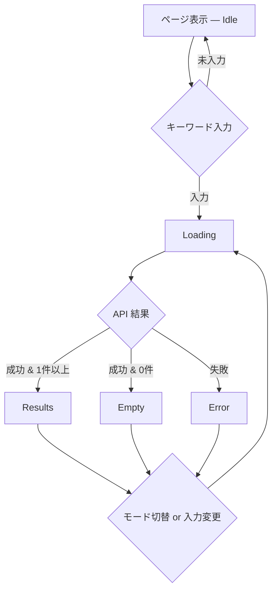

# 旅行者向け検索 UI — Figma AI 設計指示書

> **プロダクト名:** tabipla（旅プラ）  
> **対象アプリ:** `apps/user-web`（旅行者向け Web フロント — 観光スポット検索）  
> **デモ地域:** 長野県小諸市  
> **想定利用者:** 旅行・観光を計画する一般ユーザー（**スマホ利用が主**。現地・移動中の片手操作を想定）  
> **デザイン基準サイズ:** **390 × 844px**（iPhone 14 相当。Figma フレームはこのサイズを Must とする）

---

## 0. この文書の目的

Figma AI（Make designs / First draft 等）に、**旅行者が観光スポットをキーワード検索し、結果をカード一覧で閲覧する UI** の設計を一括で依頼するための指示書です。

コード実装は別タスクです。本指示書のゴールは、**390 × 844px（スマホ）を基準とした** Figma 画面・コンポーネント一式を得ることです。開発チームは Tailwind CSS v4 + React でモバイルファーストに実装します。

---

## 1. プロダクト背景（AI が理解すべき文脈）

tabipla は、旅行者向けに AI がスポットを推薦・蘊蓄（ローカルな豆知識）を生成する観光プラットフォームです。

```
自治体職員 ──(admin-web)──▶ backend-api ──▶ PostgreSQL（正本）
                              │
                              └──▶ Elasticsearch（検索用の写し）
                                        ▲
旅行者 ──(user-web)────────────────────┘
         └──(将来) AI エージェント
```

**user-web の役割（現状 MVP）**

- キーワード・ベクトル・ハイブリッドの 3 モードでスポットを検索
- 検索結果をカード一覧で閲覧（カテゴリ・エリア・説明・タグ・スコア）
- ローディング / エラー / 0 件 / 初期状態の表示

user-web は Elasticsearch / search-core に直接触れず、必ず `backend-api` の HTTP API 経由で検索します。

**管理画面（`apps/admin-web`）との違い**

| 項目 | user-web（本指示書） | admin-web |
|------|---------------------|-----------|
| 利用者 | 旅行者 | 自治体職員 |
| 主デバイス | **スマホ（390px 幅）** | PC（1440px 幅） |
| レイアウト | 1 ページ・縦スクロール・検索中心 | サイドバー + テーブル |
| アクセント色 | slate-900（黒に近い） | blue-600（業務ツール） |
| 主操作 | 検索・閲覧（タップ） | CRUD・一括取り込み |

---

## 2. デザインの方向性

### 2.1 トーン & マナー

| 項目 | 指示 |
|------|------|
| 印象 | **スマホ向けの軽快な旅行検索 UI**。Google アプリ検索や Airbnb モバイルに近い、縦スクロール前提のクリーンなデザイン |
| 対比 | 管理画面は業務ツール色（ネイビー + 青アクセント）。user-web は **slate ベースのモノトーン + カテゴリバッジだけ色** |
| 言語 | **UI 文言はすべて日本語** |
| 密度 | 情報密度は **低〜中**。1 画面 1 目的（検索して見つける）。**親指が届く範囲**に主要操作を置く |
| 操作 | **タップ前提**。hover より **pressed / active** 状態を定義。タップ領域は最小 **44 × 44px** |
| アクセシビリティ | コントラスト WCAG AA 相当、フォーカスリング明示、検索モードは radio group 相当 |

### 2.2 カラーパレット（Variables 化すること）

| トークン名 | 用途 | 参考値 |
|-----------|------|--------|
| `color/bg/page` | ページ背景 | `#F8FAFC`（slate-50） |
| `color/bg/surface` | ヘッダー・カード・入力 | `#FFFFFF` |
| `color/text/primary` | 見出し・スポット名 | `#0F172A`（slate-900） |
| `color/text/body` | 説明文 | `#475569`（slate-600） |
| `color/text/muted` | 補助・件数 | `#64748B`（slate-500） |
| `color/text/hint` | プレースホルダ・ヒント | `#94A3B8`（slate-400） |
| `color/border/default` | カード・ヘッダー区切り | `#E2E8F0`（slate-200） |
| `color/border/input` | 検索入力枠 | `#CBD5E1`（slate-300） |
| `color/accent/selected` | 選択中の検索モード pill | `#0F172A` |
| `color/accent/on-selected` | 選択中 pill の文字 | `#FFFFFF` |
| `color/pill/default-bg` | 未選択 pill | `#F1F5F9`（slate-100） |
| `color/pill/default-text` | 未選択 pill 文字 | `#475569`（slate-600） |
| `color/error/bg` | エラー背景 | `#FFF1F2`（rose-50） |
| `color/error/border` | エラー枠 | `#FECDD3`（rose-200） |
| `color/error/text` | エラー文字 | `#BE123C`（rose-700） |

#### カテゴリバッジ（SpotCard 用）

| カテゴリ | 背景 | 文字 |
|---------|------|------|
| 観光 | `#FFE4E6`（rose-100） | `#BE123C`（rose-700） |
| グルメ | `#FEF3C7`（amber-100） | `#B45309`（amber-700） |
| 宿泊 | `#EDE9FE`（violet-100） | `#6D28D9`（violet-700） |
| 自然 | `#D1FAE5`（emerald-100） | `#047857`（emerald-700） |
| その他 | `#F1F5F9`（slate-100） | `#475569`（slate-600） |

### 2.3 タイポグラフィ（スマホ基準）

- フォント: **Noto Sans JP** + system-ui（Web 実装では Hiragino Kaku Gothic ProN も fallback）
- ブランド「tabipla」: **24px** / Black（900）
- サブタイトル「スポットを探す」: 13px / Medium
- ガイド文・件数: 13px / Regular（行間 1.5）
- カードタイトル（スポット名）: 17px / Bold
- カード本文: 14px / Regular（最大 3 行で省略）
- キャプション・タグ・エリア: 12px / Regular
- スコア: 11px / Regular（tabular nums）

### 2.4 レイアウト基準（スマホファースト）

| 項目 | 値 |
|------|-----|
| **Must フレームサイズ** | **390 × 844px**（iPhone 14 相当） |
| 代替サイズ | 375 × 812px（iPhone SE / mini 系）— 390 を優先 |
| Safe Area | 上 **47px**（ステータスバー）、下 **34px**（ホームインジケータ）を確保 |
| コンテンツ幅 | フレーム幅 − 左右 **16px** パディング = **358px** 実効幅 |
| 左右パディング | **16px**（`px-4`） |
| 角丸 | 検索入力・カード **16px**、pill **9999px**、タグ **6px**、エラー **12px** |
| スペーシング | 8px グリッド（8 / 12 / 16 / 24 / 32） |
| カード一覧 | **1 列のみ**（幅 100%）、カード間 gap **12px** |
| 検索モード pill | **横スクロール**（1 行・はみ出し可）または 2 行折り返し。pill 高さ min **36px** |
| 検索入力 | 幅 100%、高さ **48px**（タップしやすいサイズ） |
| Desktop 拡張 | **Should**（1280px への拡張は後回し可。Must はスマホのみ） |

---

## 3. 情報設計（IA）

**単一ページ構成**（ナビゲーションなし）。URL は `/` のみ。

```
┌────────────────── 390px ──────────────────┐
│ ■ Safe Area Top (47px)                    │
├───────────────────────────────────────────┤
│  Header（白背景・下線・px-16）             │
│  ├─ tabipla（24px）                       │
│  ├─ スポットを探す（13px）                 │
│  ├─ ガイド文（2行想定）                    │
│  ├─ 検索モード pill（横スクロール 1 行）    │
│  ├─ モードヒント（1行）                    │
│  └─ 検索入力（全幅 48px）                  │
├───────────────────────────────────────────┤
│  Main（slate-50・縦スクロール）            │
│  └─ SpotCard × N（1 列・gap 12px）        │
│     or Idle / Loading / Empty / Error     │
├───────────────────────────────────────────┤
│ ■ Safe Area Bottom (34px)                 │
└───────────────────────────────────────────┘
```

---

## 4. 画面仕様（状態別 — すべて Must）

1 つの検索ページを **390 × 844px のフレーム** で、**状態ごとに別フレーム** 作成すること。  
すべて縦スクロール前提。Results 状態はカード 3 枚以上が画面をはみ出す長さにする。

---

### 4.1 検索ページ — 初期（Idle）（Must）

**条件:** 検索キーワード未入力

**ヘッダー要素（全状態共通 — スマホ縦積み）**

1. **ブランドブロック**（縦並び）
   - 「tabipla」（24px Black）
   - その下に「スポットを探す」（13px muted、gap 4px）
2. **ガイド文**（13px、最大 2 行）
   - 「行きたい場所・キーワードを入力してください（例: 京都、寺、竹林）。」
3. **検索モード pill（3 択）**
   - `キーワード` / `ベクトル` / `ハイブリッド`
   - **横スクロール 1 行**（右端が切れてもよい＝スクロール可能な見せ方）
   - pill 間 gap 8px、各 pill min-height **36px**、左右 padding 16px
   - 初期選択: **ハイブリッド**
4. **モードヒント**（12px, hint 色、1 行）
   - キーワード: 「名前・説明文の全文一致」
   - ベクトル: 「意味が近いスポットを探索」
   - ハイブリッド: 「キーワード + 意味の両方」
5. **検索入力**
   - 幅 100%（左右 16px パディング内）
   - 左: 虫眼鏡アイコン（20×20、左 inset 12px）
   - placeholder: 「キーワードで検索」
   - 高さ **48px**、角丸 16px、font-size 16px（iOS ズーム防止）

**メイン**

- 中央: 「キーワードを入力すると検索結果が表示されます。」（muted、上下余白大）

---

### 4.2 検索ページ — 検索中（Loading）（Must）

**条件:** 入力後 300ms デバウンス経過、API 応答待ち

**ヘッダー:** 検索入力に文字あり（例: 「小諸」）

**メイン**

- 中央: 「検索中…」（muted）
- （Should）スケルトンカード **2〜3 枚**（1 列・全幅）のプレースホルダ

---

### 4.3 検索ページ — 結果あり（Results）（Must — 最重要）

**条件:** 1 件以上ヒット

**ヘッダー:** 検索クエリ「小諸」、モード「ハイブリッド」選択

**メイン上部**

- 「3 件のスポットが見つかりました（ハイブリッド）」（14px muted）

**メイン本体**

- SpotCard **1 列**（幅 100%、gap 12px）
- 最低 **3 枚**表示。4 枚目以降は縦スクロールで見える構成（フレーム高 844px を超える長さ OK）

**サンプルカードデータ（小諸市）**

| 名前 | カテゴリ | エリア | 説明 | タグ | score |
|------|---------|--------|------|------|-------|
| 懐古園 | 観光, 歴史 | 長野県 / 小諸市 | 小諸城址の公園。紅葉の名所。 | #紅葉 #城址 #公園 | 0.92 |
| 高峰高原 | 自然 | 長野県 / 小諸市 | 標高約2,000mの高原。トレッキングや雲海の展望が人気。 | #トレッキング #雲海 | 0.87 |
| 停車場ガーデン | グルメ, 観光 | 長野県 / 小諸市 | 地元食材を使ったカフェと庭園。小諸の食文化を楽しめる。 | #カフェ #地元食材 | 0.81 |

---

### 4.4 検索ページ — 0 件（Empty）（Must）

**条件:** API 成功だが results.length === 0

**メイン**

- 「該当するスポットが見つかりませんでした」
- （Should）補助文: 「別のキーワードや検索モードをお試しください。」

---

### 4.5 検索ページ — エラー（Error）（Must）

**条件:** API 失敗

**メイン**

- rose 系アラートボックス
- 本文例: 「検索に失敗しました。」
- ベクトル / ハイブリッドモード時の追加文（12px）:
  - 「ベクトル/ハイブリッド検索を使う前に、`pnpm -C services/backend-api embed-spots` で embedding を投入してください。」
  - コマンド部分は monospace + 薄い rose 背景

---

## 5. コンポーネント仕様

Figma の **Component Set** として作成。Auto Layout 必須。

| コンポーネント | Variants |
|---------------|----------|
| `SearchModePill` | mode: keyword / vector / hybrid × selected: true / false |
| `SearchInput` | state: default / focus / filled |
| `CategoryBadge` | category: 観光 / グルメ / 宿泊 / 自然 / other |
| `TagChip` | default（`#タグ名` 形式） |
| `SpotCard` | default / **pressed**（タップ時。opacity 95% + 軽い scale 98%） |
| `Alert/Error` | default（複数行対応） |
| `EmptyState` | idle / empty / loading |

### SpotCard 詳細

```
┌──────────── 358px（実効幅）────────────┐
│ [観光] [歴史]                         │
│ 長野県 / 小諸市                       │  ← エリアはバッジの次行でも可
│ 懐古園                                │  ← 17px Bold
│ 小諸城址の公園。紅葉の名所。          │  ← 14px、3行 clamp
│ #紅葉 #城址 #公園                     │  ← TagChip、折り返し可
│                           score 0.92  │  ← 右下、11px muted
└───────────────────────────────────────┘
```

- 背景白、border slate-200、shadow-sm、padding **16px**、角丸 16px、**幅 100%**
- **pressed:** 背景 `#F8FAFC`、border やや濃く（タップフィードバック）
- 現状タップ遷移なし（詳細ページ未実装）

**命名規則:** `User/{Component}/{Variant}`（例: `User/SpotCard/Pressed`）

---

## 6. ユーザーフロー



---

## 7. コピー（そのまま使う日本語文案）

| 場面 | 文案 |
|------|------|
| ブランド | tabipla |
| サブタイトル | スポットを探す |
| ガイド文 | 行きたい場所・キーワードを入力してください（例: 京都、寺、竹林）。 |
| 検索 placeholder | キーワードで検索 |
| モード: キーワード | キーワード |
| モード: ベクトル | ベクトル |
| モード: ハイブリッド | ハイブリッド |
| ヒント: キーワード | 名前・説明文の全文一致 |
| ヒント: ベクトル | 意味が近いスポットを探索 |
| ヒント: ハイブリッド | キーワード + 意味の両方 |
| 初期状態 | キーワードを入力すると検索結果が表示されます。 |
| ローディング | 検索中… |
| 結果件数 | {N} 件のスポットが見つかりました（{モード名}） |
| 0 件 | 該当するスポットが見つかりませんでした |
| エラー | 検索に失敗しました。 |

---

## 8. admin-web との一貫性

- **同じフォント**（Noto Sans JP）と **角丸尺度**（カード 16px）を維持
- **カテゴリバッジの色・用語**（観光 / グルメ / 宿泊 / 自然）が管理画面一覧と一致
- **スポット名・エリア・タグ** の表示形式が admin-web のテーブル列と対応
- ただし **アクセント色は slate-900**（管理画面の blue-600 は使わない）

---

## 9. Figma ファイル構成

```text
📄 Cover
   └── tabipla User Web · Mobile First · 390×844

📄 Foundations
   └── Colors / Typography / Spacing / Safe Area / Icons

📄 Components
   └── SearchModePill, SearchInput, CategoryBadge, TagChip, SpotCard, Alert, EmptyState

📄 Screens — Mobile (390×844)  ← Must（すべてここ）
   └── Search — Idle / Loading / Results / Empty / Error

📄 Screens — Desktop (1280)    ← Should（任意・後から拡張）
   └── Search — Results のみ（1 参考フレームで可）
```

管理画面デザインと同一 Figma ファイルに置く場合は、**User** と **Admin** でページを分離し、Variables コレクションも分けること。

---

## 10. Figma AI への具体的プロンプト例

Figma AI にこのファイルを添付するか、以下を順に投入してください。

### Prompt 1 — デザインシステム（スマホ）

```
Create a MOBILE-FIRST design system for "tabipla User Web" — Japanese tourism spot search for travelers.
Frame width 390px. Safe area: top 47px, bottom 34px. Horizontal padding 16px.
Use Noto Sans JP, 8px grid, colors: page bg #F8FAFC, text primary #0F172A, accent #0F172A (NOT blue).
Build SearchModePill, SearchInput, CategoryBadge, TagChip, SpotCard (with pressed state), Alert.
Touch targets min 44px. All labels in Japanese.
```

### Prompt 2 — 検索ページ（最重要・390×844）

```
Design a mobile spot search UI at 390×844px (iPhone 14):
- Safe areas at top and bottom
- White header: stacked brand "tabipla" + subtitle "スポットを探す"
- Guide text, horizontally scrollable search mode pills (キーワード / ベクトル / ハイブリッド), hint below
- Full-width search input (48px height, 16px font, magnifying glass icon)
- Main: single-column SpotCards (full width, 12px gap), vertically scrollable
Create separate frames: Idle, Loading, Results (3+ Komoro spots: 懐古園, 高峰高原, 停車場ガーデン), Empty, Error.
```

### Prompt 3 — SpotCard pressed

```
Add pressed/tap state to SpotCard for mobile: subtle background change, no hover lift.
Show in Components page.
```

### Prompt 4 — Desktop（任意）

```
Optional: adapt Results screen to 1280px with 3-column card grid. Mobile 390px remains the source of truth.
```

---

## 11. 成果物チェックリスト（Figma AI の完了条件）

- [ ] Variables（色・スペーシング・半径）が定義されている
- [ ] コンポーネントセットが Auto Layout 化されている
- [ ] **すべての Must 画面が 390 × 844px** で存在する
- [ ] Safe Area（上 47px / 下 34px）が確保されている
- [ ] 左右パディング 16px、SpotCard **1 列・全幅** になっている
- [ ] 検索モード pill が横スクロール or 折り返しでスマホ幅に収まっている
- [ ] タップ領域が 44px 以上（入力・pill）
- [ ] SpotCard の **pressed** 状態が定義されている
- [ ] カテゴリ 4 色 + other が Component 化されている
- [ ] 日本語文案が小諸市デモデータで入っている
- [ ] 管理画面 UI と視覚的に区別できる（slate アクセント、青ボタンなし）
- [ ] 検索モード 3 択 + 各ヒント文が揃っている

---

## 12. 対象外（設計しないこと）

- ログイン / 会員機能
- スポット詳細ページ・地図表示
- カテゴリ・エリアフィルタ UI
- ページネーション / 無限スクロール
- AI エージェントのスワイプ UI（`services/agent` 側）
- admin-web の CRUD 画面
- ダークモード
- 英語 UI

---

## 13. 参考データ（API フィールド）

```json
{
  "id": "spot-kiyomizu",
  "score": 0.92,
  "document": {
    "id": "spot-kiyomizu",
    "name": "懐古園",
    "description": "小諸城址の公園。紅葉の名所。",
    "category": ["観光", "歴史"],
    "area": "小諸市",
    "prefecture": "長野県",
    "tags": ["紅葉", "城址", "公園"]
  }
}
```

表示ルール:

- `category` は文字列 or 配列 → バッジ複数可
- `prefecture` + `area` → 「長野県 / 小諸市」
- `tags` → `#` 付き Chip
- `score` が null のときは非表示

---

## 14. 関連ドキュメント（実装側）

| ドキュメント | 内容 |
|-------------|------|
| `apps/user-web/src/App.tsx` | ページ全体・検索 UI・状態分岐 |
| `apps/user-web/src/components/SpotCard.tsx` | 結果カード |
| `apps/user-web/src/types.ts` | データ型 |
| `apps/user-web/README.md` | 機能概要・技術スタック |
| `docs/figma-admin-design-brief.md` | 管理画面デザイン（対比用） |
| `docs/figma-api-setup.md` | Figma REST API 連携 |

---

*最終更新: 2026-06-21（スマホファースト 390×844 に改訂）*
