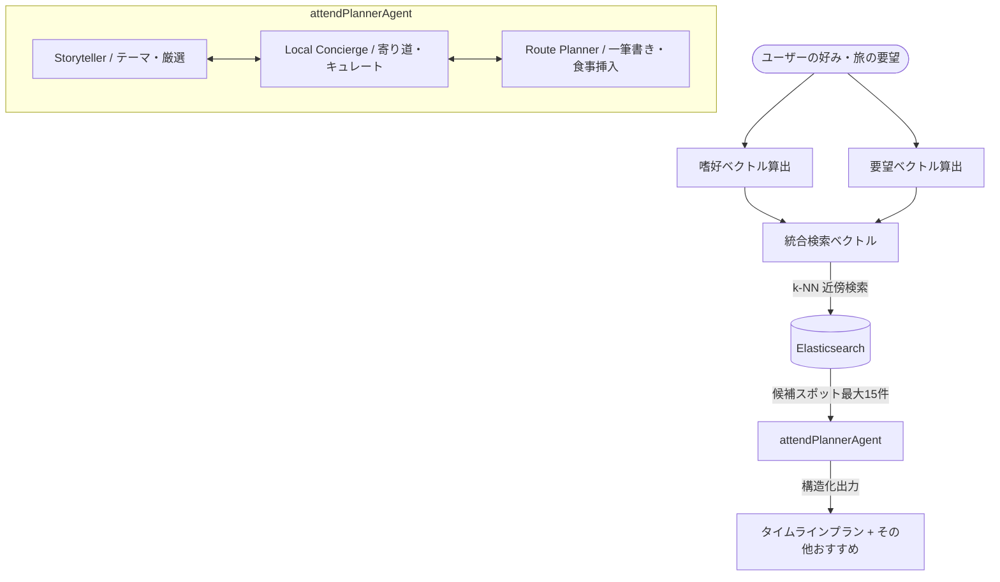

# tabipla マルチエージェント推薦システム アーキテクチャ構成

本ドキュメントでは、`services/agent` で提供するパーソナライズ旅行プラン生成（`/v1/personalized/plan`）における、**120点アテンド協調型マルチエージェント推薦システム**の設計と仕組みについて解説します。

---

## 1. 全体アーキテクチャ概要

パーソナライズ推薦は、単純なルールベースのソートや単一のLLM呼び出しではなく、**3つの異なる役割（エージェント知性）**が1つのプロンプト/コンテキスト内で自律的に協調し合い、ユーザーの要望と時間制約を最適化する「協調型マルチエージェント方式（`attendPlannerAgent`）」を採用しています。



---

## 2. 3つの知的役割（エージェント）と協調プロセス

`attendPlannerAgent` は、以下の3つの専門的ロールを内包し、協調して動作します。

### ① Storyteller（ストーリーテラー）
* **役割**: 旅全体の一貫したコンセプト（テーマ）の策定、およびメインスポットの厳選。
* **処理**:
  * ユーザープロファイル（好みサマリー）と「旅の要望」から、旅の情緒的な感情軸となるストーリーライン（テーマ）を決定します。
  * 候補リスト（最大15件）から、そのストーリーに最も合致する本命スポット（2〜4件）を厳選します。

### ② Local Concierge（ローカルコンシェルジュ）
* **役割**: スポット間に心地よい余白や寄り道（散策、小休止）を配置する。
* **処理**:
  * 厳選された主要スポットの合間に、旅程の緩急を整えるためのブレイクタイム（例: 「地元食材を楽しむハーブ園でのカフェ休憩」「情緒ある馬場裏通りの散策」など）を挿入します。

### ③ Route Planner（ルートプランナー）
* **役割**: 物理的移動順路の最適化と、時間予算に応じた食事枠の強制挿入。
* **処理**:
  * 出発地からの移動経路を考慮し、最も無駄のないスムーズな「一筆書き順路（時系列タイムライン）」にスポットをソートします。
  * **食事時間の自動考慮ルール**:
    * 時間予算が「丸々一日（`1day`）」または「半日（`half`）」であり、昼食（12:00〜13:30）や夕食（18:00〜19:30）の時間帯をまたぐ旅程の場合、**候補リストに飲食店が含まれていなくても、タイムラインの適切な位置に自動的に『ランチタイム』または『ディナータイム』の休憩（type: 'break'）を挿入**します。
    * 時間予算が「スキマ時間（`short`）」の場合は、食事時間を考慮せず、クイックにスポットを周るプランを構築します。

---

## 3. データフローと処理パイプライン

ユーザーが「プランを作成する」を実行してから結果が返却されるまでのデータフローは以下の通りです。

```
1. 嗜好ベクトル・要望ベクトルの算出 (personalized.ts)
   - スワイプのLikes履歴の重心ベクトル (v_pref) と、旅の要望（travelMemory）のテキスト埋め込みベクトル (v_comment) を 50%:50% で重み付け結合して「統合検索ベクトル (v_query)」を算出します。

2. 地理的近傍検索による一次絞り込み (ES k-NN)
   - 出発地周辺（小諸駅など）から半径15km圏内に位置するスポットを、v_query に基づく k-NN 近傍検索で最大15件キュレートします。

3. 120点アテンドエージェントの協調プラン作成 (rerank.ts)
   - attendPlannerAgent (gemini-2.5-flash) が起動し、3つの役割が協調して一筆書きの「プラン（タイムライン）」および「アテンド紹介文 (result: 100文字以内のカジュアルな紹介文)」を出力します。

4. DB行による情報エンリッチメント (backend-api / spotCatalog.ts)
   - エージェントが選択したスポットIDに基づいて、PostgreSQLデータベースから最新の公式画像（/uploads/spots/...webp）、紹介文、住所、タグなどの詳細情報をマージしてフロントエンドに返却します。
```

---

## 4. セーフティネットとモックフォールバック

本システムは、外部APIエラー時やVertex AIの制限時でもサービスが完全に停止しないよう、多層のフォールバックを搭載しています。

* **Gemini (Vertex AI) エラー時のフォールバック**:
  * APIキー不足や一時的なサーバーダウンなどで `runRerank` が失敗した場合、`personalized.ts` は自動的に k-NN 検索でヒットした実スポットの先頭 3件を取り出し、標準的な時間枠に当てはめた一筆書きのタイムラインを生成します。
  * この場合でも、画像はデータベース上の本物の写真パスが適用され、正しいUIでプランが表示されます。
